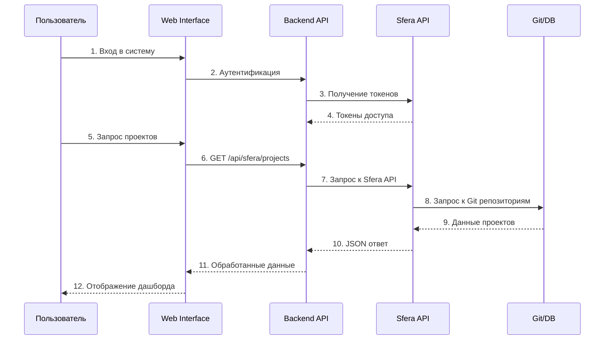

(slide1)
# ОТ ХАОСА КОММИТОВ К ПОРЯДКУ В ПРОЦЕССАХ

## РЕШЕНИЕ КОМАНДЫ TOPOR.TECH

### ПРОЕКТ: Создание системы автоматизированного анализа эффективности команд разработки

---

**Проблема:** Хаотичные процессы разработки, отсутствие видимости эффективности команд

**Решение:** Автоматизированная система анализа и мониторинга

**Результат:** Упорядоченные процессы, измеримая эффективность, прозрачность работы команд

---
(slide2)

live demo 
https://sfera.gitcto.space/

используйте вах логин и пароль на платформе 

---
(slide3)
## Интеграция и сбор данных

**Основной поток:**
- Аутентификация через Sfera API
- Получение списка проектов и репозиториев  
- Сбор данных о коммитах и ветках
- Обработка и визуализация в дашбордах

---
(slide4)
## Веб-дашборд и UX

TODO набор скриншетов

---
(slide5)
## Расчет метрик и KPI

### Throughput (Пропускная способность)
- Количество завершенных задач в заданный период времени (например, спринт или месяц)
- Позволяет отслеживать продуктивность команды во времени и сравнивать с бэклогом

### Cycle Time (Время цикла)
- Измеряет время, необходимое для перехода задачи от "в работе" к "завершено"
- Помогает выявить узкие места и области для улучшения процессов

### Work-in-Progress (Работа в процессе)
- Мониторинг количества задач, находящихся в работе в данный момент
- Помогает убедиться, что команда не перегружает себя слишком большим количеством параллельных задач, что может замедлить общую доставку

---
(slide6)

kpi metrics on site, screanshots 

---
(slide7)

## Система рекомендаций

### Высокоуровневый светофор на основе отклонений метрик

**🔴 Красный свет - Критические проблемы:**
- Большой WIP (Work-in-Progress) - команда перегружена параллельными задачами
- Низкий Throughput - мало задач мерджится в мастер, проблемы с завершением работы
- Высокое соотношение Cycle Time к размеру задачи - неэффективная обработка задач

**🟡 Желтый свет - Требует внимания:**
- Умеренные отклонения от нормы по метрикам
- Необходим мониторинг и корректирующие действия

**🟢 Зеленый свет - Все в норме:**
- Оптимальные значения всех метрик
- Команда работает эффективно

### Критерии оценки:
- **WIP**: Слишком много задач в работе одновременно
- **Cycle Time vs размер задачи**: Анализ эффективности обработки задач разного размера
- **Throughput**: Низкая скорость мерджа в мастер (по команде и по разработчику)

---
(slide 8)

### Технологический стек:

- **Backend:** Python, FastAPI
- **Frontend:** React, TypeScript
- **Интеграции:** Git, системы управления проектами
- **Визуализация:** Современные дашборды и графики

---
(slide 9)

### Команда:

1. **Александр Рябченко** (капитан)
2. **Виктория Жданова**
3. **Ольга Пасынкова**
4. **Татьяна Герасимова**