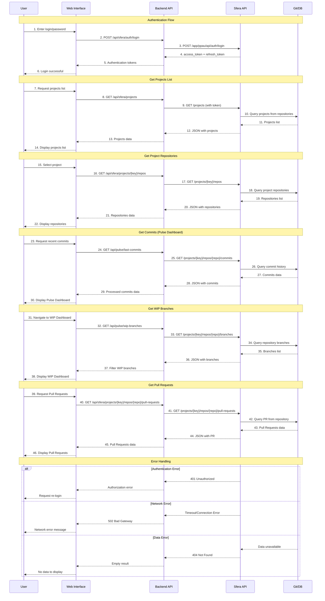

# Sequence Diagram - Sfera Pulse System

## Описание компонентов системы

### 👤 Пользователь
- Взаимодействует с веб-интерфейсом через браузер
- Вводит учетные данные для аутентификации
- Просматривает дашборды Pulse и WIP
- Выбирает проекты и репозитории для анализа

### 🌐 Web Interface (React Frontend)
- **Технологии**: React + TypeScript + Vite
- **Функции**:
  - Аутентификация пользователя
  - Отображение Pulse Dashboard (последние коммиты)
  - Отображение WIP Dashboard (рабочие ветки)
  - Выбор проектов и репозиториев
  - Обработка ошибок и состояний загрузки

### ⚙️ Backend API (FastAPI)
- **Технологии**: Python + FastAPI
- **Функции**:
  - Проксирование запросов к Sfera API
  - Аутентификация через Sfera платформу
  - Обработка и фильтрация данных
  - CORS поддержка для фронтенда
  - Обработка ошибок и таймаутов

### 🔗 Sfera API (External)
- **Функции**:
  - Аутентификация пользователей
  - Предоставление доступа к Git репозиториям
  - API для работы с проектами, репозиториями, коммитами
  - Управление Pull Requests и ветками

### 📊 Git/DB (Repository Storage)
- **Функции**:
  - Хранение Git репозиториев
  - История коммитов
  - Информация о ветках
  - Данные Pull Requests
  - Метаданные проектов
